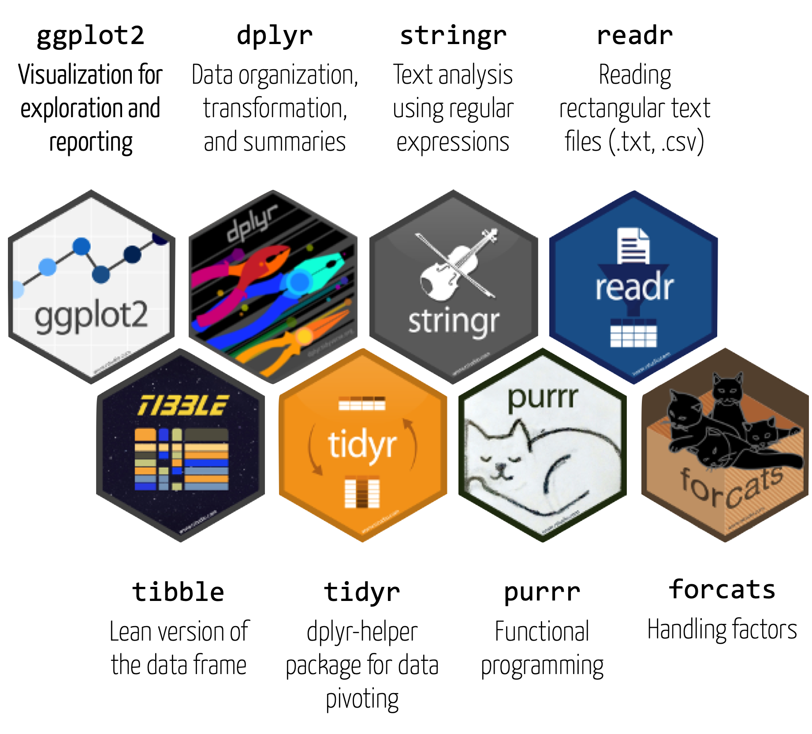

layout: true

<div class="my-footer">
  <span style="text-align:center">
    <span> 
      
    </span>
    <a href="https://therbootcamp.github.io/">
      <span style="padding-left:82px"> 
        <font color="#7E7E7E">
          https://correlaid.org/correlaid-x/switzerland/
        </font>
      </span>
    </a>
    <a href="https://correlaid.org/correlaid-x/switzerland/">
      <font color="#7E7E7E">
      Data Visualization for Social Good | February 2021
      </font>
    </a>
    </span>
  </div> 

---

```{r setup, include=FALSE}
options(htmltools.dir.version = FALSE)
# see: https://github.com/yihui/xaringan
# install.packages("xaringan")
# see: 
# https://github.com/yihui/xaringan/wiki
# https://github.com/gnab/remark/wiki/Markdown
options(width=110)
options(digits = 4)

require(tidyverse)
require(plotly)
require(sf)

basel <- read_csv('1_Data/taxation.csv')
basel_map = read_sf('1_Data/map')

```


# The R <mono>tidyverse</mono> can do a lot more

.pull-left5[

<font size = 6>

1. `tidyverse` core<br>
2. `tidyverse` extended<br>

</font>


]

.pull-right5[
<p align="center"></p>
]


---

.pull-left3[

# <mono>tidyverse</mono> core

<ul>
  <li class="m1"><span>The tidyverse is...</span></li><br>
  <ul class="level">
    <li><span>A collection of user-friendly <high>packages</high> for analyzing <high>tidy data</high></span></li><br>
    <li><span>An <high>ecosystem</high> for analytics and data science with common design principles</span></li><br>
    <li><span>A <high>dialect</high> of the R language</span></li>
  </ul>
</ul>

]


.pull-right6[
<br>
<p align="left">
  
</p>

]

---

.pull-left2[

# `tidyverse` extended

<ul>
  <li class="m1"><span>The tidyverse is...an <high>ecosystem</high> for analytics and data science with common design principles</span></li>
</ul>

]

.pull-right65[

<br><br>

<p align="left">
  
</p>

]


---

#  <mono>gganimate</mono> <font style="font-size:24px">for animations</font>

.pull-left45[

```{r, eval = F}
basel %>% 
  ggplot(aes(x = year, col = quarter)) + 
  geom_point(aes(y = wealth_mean)) + 
  geom_line(aes(y = wealth_mean)) + 
  guides(col = FALSE) +
  theme_minimal() + 
  
  # add animation
  transition_reveal(year)

```

]

.pull-right45[

<p align="center">
  
</p>


]

---

#  <mono>gganimate</mono> <font style="font-size:24px">for animations</font>

.pull-left5[

```{r, eval = F}
plot = basel_map %>% 
  
  # original code
  left_join(basel, 
            by = c('TYPE' = 'quarter')) %>% 
  ggplot(aes(fill = wealth_mean)) + 
  geom_sf(col = 'white') + 
  guides(fill = FALSE) + 
  theme_void() +
  
  # add animation
  ggtitle("{closest_state}") +
  theme(plot.title = element_text(
    hjust = 0.5,size=20)) +
  transition_states(year)

```

]

.pull-right45[

<p align="center">
  
</p>


]

---

#  <mono>plotly</mono> <font style="font-size:24px">for interactive graphics</font>

.pull-left5[

```{r, eval = F}
# original plot
plot <- basel_map %>% 
  left_join(basel, 
            by = c('TYPE' = 'quarter')) %>% 
  ggplot(aes(x = year, col = TYPE)) + 
  geom_point(aes(y = wealth_mean)) + 
  geom_line(aes(y = wealth_mean)) + 
  guides(col = FALSE) +
  theme_minimal() 
  
# plotlify
ggplotly(plot)

```

]

.pull-right45[

```{r, eval = T, echo = F}
plot <- basel_map %>% 
  left_join(basel, 
            by = c('TYPE' = 'quarter')) %>% 
  ggplot(aes(x = year, col = TYPE)) +
  geom_point(aes(y = wealth_mean)) + 
  geom_line(aes(y = wealth_mean)) + 
  theme_minimal() +
  theme(legend.position='none')
  
# plotlify
ggplotly(plot)

```

]

---

.pull-left45[

#  <mono>RMarkdown</mono> <font style="font-size:24px">for reports</font>

<p align="left"></p>
]

.pull-right45[
<br><br>
<p align="center"></p>
]


---

#  <mono>shiny</mono> <font style="font-size:24px">for web apps</font>

.pull-left45[

```{r, eval = F}
ui <- fluidPage(
  tabsetPanel(
      tabPanel(
          selectInput(
            "var", "Variable",
            choices = list("wealth_mean",
                           "wealth_median",
                           "wealth_gini"))),
      mainPanel(plotOutput("basel"))))

server <- function(input, output) {
  output$basel <- renderPlot({
          ggplot(map) + 
          geom_sf(
            col = 'white', 
            mapping = aes_string(
              fill = input$var)) + 
          guides(fill = FALSE) + 
      theme_void()})}
```

]


.pull-right45[
<iframe width="400" height="600" src="https://econpsychbasel.shinyapps.io/basel/" frameborder="0" allowfullscreen></iframe>
]

---

#  <mono>rvest</mono> <font style="font-size:24px">for web scraping</font>

```{r, echo = F, message=F}
options(tibble.print_max = 6, tibble.width=90)
library(xml2) ; library(rvest) ; library(tibble)
```

```{r, message=F}
# Tabelle laden von Wikipedia (Pakete nicht vergessen)
read_html("https://en.wikipedia.org/wiki/R_(programming_language)") %>%
  html_node(xpath = '//*[@id="mw-content-text"]/div[1]/table[2]') %>%
  html_table() %>% as_tibble()
```


---

#  <mono>tidytext</mono> <font style="font-size:24px">for text analysis</font>

```{r, echo = F, message=F}
library(tidytext) ; library(wordcloud)
library(dplyr) ; library(stringr)
```

.pull-left5[

```{r, message=F, eval=F}
# Wörter zählen
counts <- 
  read_html(".../R_(programming_language)") %>%
  html_text() %>%
  tibble() %>%
  unnest_tokens(w, ".") %>%
  filter(!str_detect(w, '[:digit:]')) %>%
  anti_join(stop_words) %>%
  count(word, sort = TRUE) %>%
  top_n(100) 

# Wordwolke
wordcloud(counts$word, 
          counts$n)
  
```

]

.pull-right4[

```{r, message=F, warning=F, echo=F, fig.width=5,fig.height=5,dpi=300}
library(dplyr) ; library(tidytext) ; library(wordcloud) ; library(stringr)

# Count words
counts <- 
  read_html("https://en.wikipedia.org/wiki/R_(programming_language)") %>%
  html_text() %>%
  tibble() %>%
  unnest_tokens(word, ".") %>%
  filter(!str_detect(word, '[:digit:]')) %>%
  anti_join(stop_words %>% bind_rows(tibble(word = 'retrieved', lexicon = ''))) %>%
  count(word, sort = TRUE) %>%
  top_n(100) 

# Word cloud
par(mar=c(0,0,0,0))
wordcloud(counts$word, 
          counts$n)
  
```

]

---

#  <mono>tidymodels</mono> <font style="font-size:24px">for machine learning</font>

.pull-left4[

<ul>
  <li class="m1"><span>Framework for machine learning.</span></li><br>
  <li class="m2"><span>Includes</span></li>
  <ul class="level">
    <li><span>All sorts of models, including wrapper to <a href="https://keras.rstudio.com/">keras</a>, for deep learning.</span></li> 
    <li><span>Model tuning</span></li> 
    <li><span>Model evaluation</span></li> 
    <li><span>etc.</span></li> 
  </ul>
</ul>


]

.pull-right45[
<p align="center"></p>

]

---

.pull-left45[

#  <mono>dbplyr</mono><br> <font style="font-size:24px">for wrangling remote databases</font>

<ul>
  <li class="m1"><span>R tidyverse is able to interface with most database types</high>: <mono>MySQL</mono>, <mono>MariaDB</mono>, <mono>BigQuery</mono>, <mono>Redshift</mono>, etc. See <a href="https://db.rstudio.com/databases">db.rstudio.com</a>.</font></span></li>
  <li class="m2"><span><mono>dplyr</mono> will be <high>translated in the backround</high> to the appropriate query language</span></li>
</ul>

]

.pull-right45[

<br>

```{r, include=F}

require(DBI)
require(RMySQL)

```

```{r, echo = F, message=F}
require(tibble)
options(tibble.width = 40, tibble.max_extra_cols = 0, tibble.print_max = 3,
        tibble.print_min = 5)
```


```{r}
# Verbinge mit MySQL Datenbank
con <- dbConnect(MySQL(), 
         user='studiech_rbootca', 
         password='Du*5hA+7NU:8T', 
         dbname='studiech_rbootcamp', 
         host='studie.ch',
         port = 3306)

# Extrahiere Tabelle Customers
basel <- tbl(con, "basel")
basel
```

]

---

# Books  

An incomplete list of good books loosely sorted by required amount of R experience.<br><br>

<table width="80%" style="cellspacing:0; cellpadding:0; border:none;">

  <tr>    

  <td> 
  <a href="http://r4ds.had.co.nz/"></a>
  </td>

  <td>
  <a href="https://covers.oreillystatic.com/images/0636920028574/cat.gif"></a>
  </td>

  <td> 
  <a href="https://ggplot2-book.org/"></a>
  </td>

  <td>
  <a href="https://www.springer.com/de/book/9783540799979"></a>
  </td>
  
  <td>
  <a href="https://bookdown.org/ndphillips/YaRrr/"></a>
  </td>
  
  <td>
  <a href="https://www.orellfuessli.ch/shop/home/artikeldetails/ID35367941.html?ProvID=10917736&gclid=Cj0KCQiAg_HhBRDNARIsAGHLV5238Q26gQmFttHRnYGjcAhz4CslStb-3qBegvuZS5gnCpWSLNlQvF0aAgfOEALw_wcB"></a>
  </td>
  
  </tr>
  

  <tr style="background-color:#ffffff">

  <td>
  <a href="http://appliedpredictivemodeling.com/"></a>
  </td>
  
  <td>
  <a href="http://www-bcf.usc.edu/~gareth/ISL/ISLR%20First%20Printing.pdf"></a>
  </td>
  
  <td>
  <a href="https://www.manning.com/books/deep-learning-with-r"></a>
  </td>


  <td>
  <a href="https://csgillespie.github.io/efficientR/"></a>
  </td>

  <td>
  <a href="www.rcpp.org/"></a>
  </td>
  
  
  <td>
  <a href="http://adv-r.had.co.nz/"></a>
  </td>


  </tr>
  


</table>
<br>

---

class: center, middle

# Thank you!

