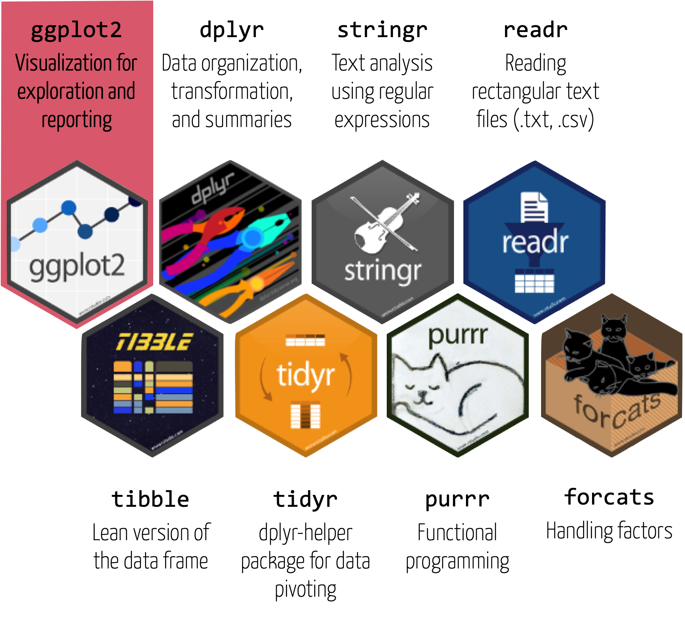

layout: true

<div class="my-footer">
  <span style="text-align:center">
    <span> 
      
    </span>
    <a href="https://therbootcamp.github.io/">
      <span style="padding-left:82px"> 
        <font color="#7E7E7E">
          therbootcamp.github.io
        </font>
      </span>
    </a>
    <a href="therbootcamp.github.io">
      <font color="#7E7E7E">
      Intro to data visualization with ggplot2 | Novemeber 2021
      </font>
    </a>
    </span>
  </div> 

---


```{r setup, include=FALSE}
options(htmltools.dir.version = FALSE)
# see: https://github.com/yihui/xaringan
# install.packages("xaringan")
# see: 
# https://github.com/yihui/xaringan/wiki
# https://github.com/gnab/remark/wiki/Markdown
options(width=110)
options(digits = 4)
```

```{r, echo = FALSE ,message = FALSE, warning = FALSE}
knitr::opts_chunk$set(comment=NA, fig.width=6, fig.height=6, 
                      echo = TRUE, eval = TRUE, 
                      message = FALSE, warning = FALSE, 
                      fig.align = 'center', dpi = 200)
library(tidyverse)
library(lubridate)
library(ggthemes)
project_sdgs = read_csv('1_Data/sdg_hackathon_data.zip')
```


.pull-left3[

# Tidyverse

<ul>
  <li class="m1"><span>The tidyverse is...</span></li><br>
  <ul class="level">
    <li><span>A collection of user-friendly <high>packages</high> for analyzing <high>tidy data</high></span></li><br>
    <li><span>An <high>ecosystem</high> for analytics and data science with common design principles</span></li><br>
    <li><span>A <high>dialect</high> of the R language</span></li>
  </ul>
</ul>

]

.pull-right65[
<br><br>
<p align="center">

</p>
]

---

# Modular graphics in <mono>ggplot2</mono>

.pull-left45[

<ul>
  <li class="m1"><span><highm>data</highm>: the data set</span></li>
  <li class="m2"><span><highm>mapping</highm>: the plot's structure</span></li>
  <ul class="level">
    <li><span>What do the axes represent?</span></li>
    <li><span>What do size, shapes, colors, etc. represent?</span></li>
  </ul>
  <li class="m3"><span><highm>geoms</highm>: geometric shapes illustrating data</high></span></li>
  <li class="m4"><span><highm>labs</highm>: Plot annotation</high></span></li>
  <li class="m5"><span><highm>themes</highm>: Aesthetic details</high></span></li>
  <li class="m6"><span><highm>facets</highm>: Stratify plot according to variable</high></span></li>
  <li class="m7"><span><highm>scales</highm>: Scaling of dimensions</high></span></li>
</ul>

]


.pull-right45[

```{r, echo = FALSE, fig.width = 5, fig.height = 4, dpi=250}
                                               
sdg_props = project_sdgs %>% 
  mutate(year = year(start_date)) %>% 
  group_by(system, sdg, year) %>% 
  summarize(n = n()) %>% 
  filter(year > 2008 & year < 2022,
         system == "elsevier",
         sdg %in% c("SDG-01", "SDG-06")) %>% 
  group_by(system, year) %>% 
  mutate(prop = n / sum(n))

sdg_props %>% 
  ggplot(aes(x = year, y = prop, col = sdg)) +
  geom_point() + geom_line()
```

]

---

# Wrangling

.pull-left45[

```{r}
sdg_props = project_sdgs %>% 
  
  # create year variable
  mutate(year = year(start_date)) %>% 
  
  # count projects by system, sdg, and year
  group_by(system, sdg, year) %>% 
  summarize(n = n()) %>% 
  
  # filter year, system 
  filter(year > 2008 & year < 2022,
         system == "elsevier",
         sdg %in% c("SDG-01", "SDG-06")) %>% 
    
  # normalize within year
  group_by(year) %>% 
  mutate(prop = n / sum(n))
```

]


.pull-right45[

```{r, echo = F, message=F}
require(tibble)
options(tibble.width = 35, tibble.max_extra_cols = 10, tibble.print_max = 5,
        tibble.print_min = 8)
```


```{r, fig.width = 5, fig.height = 4}
sdg_props
```

]


---

# `ggplot()`


.pull-left45[

<ul>
  <li class="m1"><span>All plots start with <mono>ggplot()</mono></span></li>
  <li class="m2"><span>Two arguments</span></li>
  <ul class="level">
    <li><span><mono>data</mono> | The data set (<mono>tibble</mono>)</span></li>
    <li><span><mono>mapping</mono> | The plot structure. Defined using <mono>aes()</mono>
  </ul>
  </span></li>
</ul>

]


.pull-right45[

```{r, fig.width = 5, fig.height = 4}
ggplot(data = sdg_props)
```

]


---

# `aes()`


.pull-left45[

<ul>
  <li class="m1"><span><mono>aes()</mono> helps define the structure of the <highm>mapping</highm> argument.</span></li>
  <li class="m2"><span>Key arguments:</span></li>
  <ul class="level">
    <li><span><mono>x, y</mono> | Defines axes</span></li>
    <li><span><mono>color,fill</mono> | Defines colors</span></li>
    <li><span><mono>alpha</mono> | Defines opacity</span></li>
    <li><span><mono>size</mono> | Defines sizes</span></li>
    <li><span><mono>shape</mono> | Defines shapes (e.g., circles or squares)</span></li>
  </ul>
</ul>

<br>

```{r, fig.width = 5, fig.height = 4, eval = F }
ggplot(data = sdg_props,
       mapping = aes(x = year, 
                     y = prop))
```


]

.pull-right45[

```{r, fig.width = 5, fig.height = 4, echo  = F}
ggplot(data = sdg_props,
       mapping = aes(x = year, 
                     y = prop))
```

]

---

# <mono>+</mono>

.pull-left45[

<ul>
  <li class="m1"><span>The <mono>+</mono> operator "adds" <high>additional elements</high> to the plot.</span></li>
  <li class="m1"><span>Not to be confused with the pipe <mono>%>%</mono>.</span></li>
</ul>

<br>

```{r, eval = FALSE, fig.width = 5, fig.height = 4, out.width = "90%"}
ggplot(data = sdg_props,
       mapping = aes(x = year, 
                     y = prop)) +
  
  # Show as points
  geom_point() 
```

]


.pull-right45[


```{r, echo = FALSE, fig.width = 5, fig.height = 4}
ggplot(data = sdg_props,
       mapping = aes(x = year, 
                     y = prop)) +
  
  # Show as points
  geom_point() 
```


]

---

# `geom_*()`

.pull-left45[

<ul>
  <li class="m1"><span><mono>geom_*()</mono> functions define which geometric objects are used to illustrate the data.</span></li>
  <li class="m2"><span>A few examples <mono>geoms</mono>:</span></li>
  <ul class="level">
    <li><span><mono>geom_point()</mono> | for points</span></li>
    <li><span><mono>geom_line()</mono> | for lines</span></li>
    <li><span><mono>geom_smooth()</mono> | for smooth curves</span></li>
    <li><span><mono>geom_bar()</mono> | for bars</span></li>
    <li><span><mono>geom_boxplot()</mono> | for box-plots </span></li>
    <li><span><mono>geom_violin()</mono> | for violin-plots </span></li>
  </ul>
</ul>


```{r, eval = FALSE, fig.width = 5, fig.height = 4}
ggplot(data = sdg_props,
       mapping = aes(x = year, 
                     y = prop)) +
  
  # Show as points
  geom_point() 
```


]

.pull-right45[

```{r, echo = FALSE, fig.width = 5, fig.height = 4}
ggplot(data = sdg_props,
       mapping = aes(x = year, 
                     y = prop)) +
  
  # Show as points
  geom_point() 
```


]

---

# `geom_*()`

.pull-left45[

<ul>
  <li class="m1"><span><mono>geom_*()</mono> functions define which geometric objects are used to illustrate the data.</span></li>
</ul>

<br>
```{r, eval = F}
ggplot(data = sdg_props,
       mapping = aes(x = year, 
                     y = prop)) +
  
  # Show as lines
  geom_line() 
```


]

.pull-right45[

```{r, echo = FALSE, fig.width = 5, fig.height = 4}
ggplot(data = sdg_props,
       mapping = aes(x = year, 
                     y = prop)) +
  
  # Show as points
  geom_line() 
```


]

---

# `aes()`


.pull-left45[

<ul>
  <li class="m1"><span><mono>aes()</mono> helps define the structure of the <highm>mapping</highm> argument.</span></li>
  <li class="m2"><span>Key arguments:</span></li>
  <ul class="level">
    <li><span><mono>x, y</mono> | Defines axes</span></li>
    <li><span><mono>color,fill</mono> | Defines colors</span></li>
    <li><span><mono>alpha</mono> | Defines opacity</span></li>
    <li><span><mono>size</mono> | Defines sizes</span></li>
    <li><span><mono>shape</mono> | Defines shapes (e.g., circles or squares)</span></li>
  </ul>
</ul>

```{r, fig.width = 5, fig.height = 4, eval = FALSE}
ggplot(data = sdg_props,
       mapping = aes(x = year, 
                     y = prop,
                     
                     # add color aesthetic
                     col = sdg)) +
  geom_point() 
```


]

.pull-right45[

```{r, fig.width = 5, fig.height = 4, echo = FALSE}
ggplot(data = sdg_props,
       mapping = aes(x = year, 
                     y = prop,
                     
                     # add color aesthetic
                     col = sdg)) +
  geom_point() 
```

]

---

# `geom_*()`

.pull-left45[

<ul>
  <li class="m1"><span><mono>geom_*()</mono> functions define which geometric objects are used to illustrate the data.</span></li>
</ul>

<br>
```{r, eval = F}
ggplot(data = sdg_props,
       mapping = aes(x = year, 
                     y = prop,
                     col = sdg)) +
  
  # Show as lines
  geom_line() 
```


]

.pull-right45[

```{r, echo = FALSE, fig.width = 5, fig.height = 4}
ggplot(data = sdg_props,
       mapping = aes(x = year, 
                     y = prop,
                     col = sdg)) +
  
  # Show as points
  geom_line() 
```


]


---

# `geom_*()`

.pull-left45[

<ul>
  <li class="m1"><span><mono>geom_*()</mono> functions define which geometric objects are used to illustrate the data.</span></li>
</ul>

<br>
```{r, eval = F}
ggplot(data = sdg_props,
       mapping = aes(x = year, 
                     y = prop,
                     col = sdg)) +
  
  # Show as smoothed curve
  geom_smooth() 
```


]

.pull-right45[

```{r, echo = FALSE, fig.width = 5, fig.height = 4}
ggplot(data = sdg_props,
       mapping = aes(x = year, 
                     y = prop,
                     col = sdg)) +
  
  # Show as smoothed curve
  geom_smooth() 
```


]


---

# `geom_*()`

.pull-left45[

<ul>
  <li class="m1"><span><mono>geom_*()</mono> functions define which geometric objects are used to illustrate the data.</span></li>
</ul>

<br>
```{r, eval = F}
ggplot(data = sdg_props,
       mapping = aes(x = year, 
                     y = prop,
                     col = sdg)) +
  
  # Show as points and lines
  geom_point() +
  geom_line() 
```


]

.pull-right45[

```{r, echo = FALSE, fig.width = 5, fig.height = 4}
ggplot(data = sdg_props,
       mapping = aes(x = year, 
                     y = prop,
                     col = sdg)) +
  
  # Show as points and lines
  geom_point() +
  geom_line() 
```

]

---

# `facet_*()`

.pull-left45[

<ul>
  <li class="m1"><span>Facetting creates the <high>same plot for groups</high> defined by another variable.</span></li>
  <li class="m2"><span>Key functions:</span></li>
  <ul class="level">
    <li><span><mono>facet_wrap()</mono></span></li>
    <li><span><mono>facet_grid()</mono></span></li>
  </ul>
</ul>

<br>

]

.pull-right45[

```{r, fig.width = 5, fig.height = 4, echo = FALSE}
ggplot(data = sdg_props,
       mapping = aes(x = year, 
                     y = prop,
                     col = sdg)) +
  geom_point() +
  geom_line() 
```

]

---

# Wrangling

.pull-left45[


```{r, fig.width = 5, fig.height = 4, echo = TRUE}
sdg_props = project_sdgs %>% 
  mutate(year = year(start_date)) %>% 
  group_by(system, sdg, year) %>% 
  summarize(n = n()) %>% 
  
  # no filtering of systems
  filter(year > 2008 & year < 2022,
         sdg %in% c("SDG-01", "SDG-06")) %>% 
  
  # group by year and system
  group_by(year, system) %>%
  mutate(prop = n / sum(n))
```

]

.pull-right45[

```{r, echo = F, message=F}
require(tibble)
options(tibble.width = 35, tibble.max_extra_cols = 10, tibble.print_max = 5,
        tibble.print_min = 14)
```


```{r, fig.width = 5, fig.height = 4, echo = FALSE}
sdg_props
```

]

---

.pull-left45[

# `facet_*()`

<ul>
  <li class="m1"><span>Facetting creates the <high>same plot for groups</high> defined by another variable.</span></li>
</ul>

<br>

```{r, fig.width = 5, fig.height = 4, echo = TRUE, eval = F}
ggplot(data = sdg_props,
       mapping = aes(x = year, 
                     y = prop,
                     col = sdg)) +
  geom_point() +
  geom_line() +
  
  # facet by system
  facet_wrap(~system)
```

]

.pull-right45[

<br><br><br>

```{r, fig.width = 8, fig.height = 7, echo = FALSE}
ggplot(data = sdg_props,
       mapping = aes(x = year, 
                     y = prop,
                     col = sdg)) +
  geom_point() +
  geom_line() +
  
  # facet by system
  facet_wrap(~system)
```

]


---

class: middle, center

<h1><a href="therbootcamp.github.io/SDGDataViz_2021Nov/">Schedule</a></h1>


