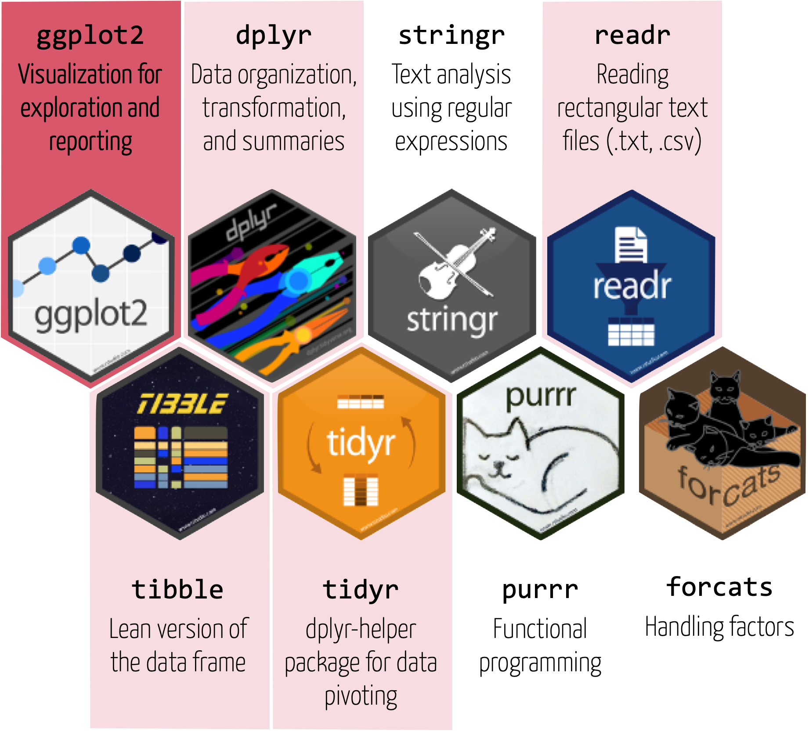

layout: true

<div class="my-footer">
  <span style="text-align:center">
    <span> 
      
    </span>
    <a href="https://therbootcamp.github.io/">
      <span style="padding-left:82px"> 
        <font color="#7E7E7E">
          therbootcamp.github.io
        </font>
      </span>
    </a>
    <a href="therbootcamp.github.io">
      <font color="#7E7E7E">
      Intro to data visualization with ggplot2 | Novemeber 2021
      </font>
    </a>
    </span>
  </div> 

---


```{r setup, include=FALSE}
options(htmltools.dir.version = FALSE)
options(width=110)
options(digits = 4)

knitr::opts_chunk$set(fig.align = 'center')
```

<!---

.pull-left45[
<br><br><br><br><br>
# Materialien

Klicke auf <high>"....running..."</high> auf unserer Website!

<font style="font-size:28px"><a href="www.therbootcamp.com"><b>www.therbootcamp.com</b></a></font>

]

.pull-right5[

<br><br>
<iframe src="https://therbootcamp.github.io" width="500" height="500"></iframe>

]

--->

.pull-left6[

<br><br><br><br><br>


# Goal


>### The goal of this workshop is to introduce to data visualization with ggplot2, with some sprinkles from the rest of the tidyverse!

]

.pull-right4[

<br><br><br><br>
<p align="center"></p>

]

---

.pull-left3[

# Tidyverse

<ul>
  <li class="m1"><span>The tidyverse is...</span></li><br>
  <ul class="level">
    <li><span>A collection of user-friendly <high>packages</high> for analyzing <high>tidy data</high></span></li><br>
    <li><span>An <high>ecosystem</high> for analytics and data science with common design principles</span></li><br>
    <li><span>A <high>dialect</high> of the R language</span></li>
  </ul>
</ul>

]

.pull-right65[
<br><br>
<p align="center">

</p>
]


---


.pull-left3[

# Tidyverse

<ul>
  <li class="m1"><span>The tidyverse is...</span></li><br>
  <ul class="level">
    <li><span>A collection of user-friendly <high>packages</high> for analyzing <high>tidy data</high></span></li><br>
    <li><span>An <high>ecosystem</high> for analytics and data science with common design principles</span></li><br>
    <li><span>A <high>dialect</high> of the R language</span></li>
  </ul>
</ul>

]

.pull-right65[
<br><br>
<p align="center">

</p>
]

---

# RStudio

.pull-left3[

<ul>
  <li class="m1"><span>RStudio is...</span></li><br>
  <ul class="level">
    <li><span>A high-productivity <high>data science IDE.</high></span></li><br>
    <li><span>The <high>company</high> behind the tidyverse.</span></li><br>
    <li><span>Designed for R tidyverse with <high>good integration</high> for Python, Markdown, or C++.</span></li><br>
  </ul>
</ul>

]

.pull-right6[
<p align="center">

</p>
]


---

.pull-left45[

<br>
# Schedule 

<ul>
  <li class="m1"><span>The core of the workshop consists of four 40min sessions.</span></li>
  <li class="m2"><span>Sessions consist of</span></li>
  <ul class="level">
    <li><span>15-20min introduction</high></span></li> 
    <li><span>20-25min coding exercises></span></li> 
  </ul>
  <li class="m3"><span>Stick around for an intro to <a href="https://correlaid.org/correlaid-x/switzerland/">Correlaid Switzerland</a> at the end.</span></li>
</ul>

]

.pull-right45[
<br><br>


]

---

class: middle, center

<h1><a href="https://www.dropbox.com/s/k82cg8p2sl1ojn7/DataViz4Good.zip?dl=1">Download<br>materials</a></h1>


---

class: middle, center

<h1><a href="https://correlaidswitzerland.github.io/DataViz4Good/">Schedule</a></h1>


